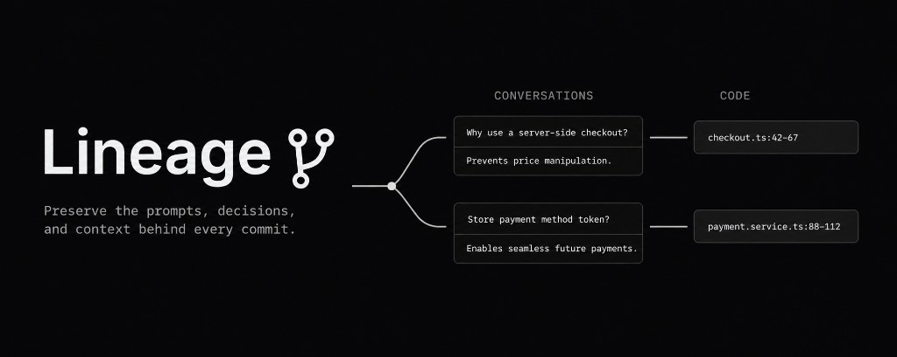

<p align="center">
  
</p>

# Tribal

[](https://rust-lang.org/tools/install)
[](https://git-scm.com/)
[](https://nodejs.org/)

**Preserve the prompts, decisions, and context behind every commit.**

```bash
git lineage init
```

Tribal is agent-first engineering context memory for your codebase. It imports sessions from Cursor, Claude Code, and Codex into your git repo, linked to the commits, files, and lines they touched, so your team and your agents can search past decisions, blame a line back to the prompt that wrote it, and pick up where a conversation left off. Stored as git refs and notes.

## Why Tribal?

Git tells you what changed. It doesn't tell you why, or what your agents already discussed three sprints ago.

Tribal closes that gap with **local, in-repo memory**: agent context lives in your git repository as refs and notes, not in a vendor cloud. It travels with `git push`, code review, onboarding, and the next agent session. Secrets are redacted before anything is written.

| | |
|---|---|
| **Agent-first** | Built for coding agents: import, search, blame, resume, and fork |
| **Agent-agnostic** | Cursor, Claude Code, and Codex today; more adapters coming |
| **Queryable everywhere** | [CLI](docs/cli/README.md), [MCP](docs/mcp/README.md), and [VS Code](extensions/vscode/README.md) |

## Install

```bash
curl --proto '=https' --tlsv1.2 -LsSf https://github.com/usetribal/tribal/releases/latest/download/lineage-cli-installer.sh | sh
```

Linux (x86_64 and arm64) and macOS (Intel and Apple silicon). The Linux builds
are static, so they run without anything installed alongside them.

Then, in your project root:

```bash
cd /path/to/your-app
git lineage init
```

## Setup from source

For contributors, or to build the VS Code extension:

### 1. Clone tribal

```bash
git clone https://github.com/usetribal/tribal.git
cd tribal
```

### 2. Install the CLI and VS Code extension

```bash
make setup
```

### 3. Add git-lineage to your PATH

```bash
export PATH="$HOME/.cargo/bin:$PATH"
```

### 4. In your project root, run the setup wizard

```bash
cd /path/to/your-app
git lineage init
```

### Development

```bash
make setup          # first-time install (see above)
make check          # full contributor gate (fmt, clippy, test, doc, extension lint)
make test           # run workspace tests
make coverage       # line coverage gate (>=80%)
make vscode-fmt     # format VS Code extension
make vscode-lint    # lint VS Code extension
make md-lint        # lint markdown
make typos          # spell check
make install-hooks  # git hooks: fmt + lint on commit
make pre-commit     # optional full hook suite (typos, markdownlint; needs pre-commit)
```

See [docs/README.md](docs/README.md) for full documentation, [CONTRIBUTING.md](CONTRIBUTING.md) for guidelines, and [AGENTS.md](AGENTS.md) for AI-assisted development.

## Troubleshooting

| Problem | What to try |
|---------|-------------|
| `git: 'lineage' is not a git command` | Ensure `~/.cargo/bin` is on `PATH`; or use `git-lineage` directly |
| `discovered 0 … session(s)` | Run `git lineage doctor`; verify [agent paths](docs/agent-paths.md); confirm you are in the repo root |
| `missing LFS` in doctor | Run `git lineage lfs fetch` after pulling refs from remote |
| Search returns nothing | Run `git lineage rebuild index`, or search again (auto-rebuilds on empty results) |
| Blame shows no sessions | Run `git lineage import` then commit (or `install-hook`); line objects materialize at link time |
| Sessions contain secrets | Run `git lineage init --config`; use `export --redact` before sharing; review `refs/lineage/config` excludes |

Target a different repository path with `--repo /path/to/repo` on any command.

## Roadmap

```text
[x] Rebase-aware lineage remapping (git lineage remap)
[x] Git LFS backend for large session content (git lineage lfs push/fetch)
[x] Repo config ref (refs/lineage/config) and incremental import
[x] Pre-commit and post-commit hooks for automatic import and linking
[x] One-command project setup (make setup)
[x] Bundled agent skill install (git lineage init --skills)
[x] Session author attribution (prompted_by_email / prompted_by_name)
[x] Multi-signal commit mapping, code-only import default, session delete/purge, and git lineage gc
[x] Image artifacts (content-addressed LFS) and heuristic architecture summaries
[x] LFS HTTP batch API transport (alongside git-lfs CLI and ref fallback)
[x] VS Code extension: session timeline, gutter decorations, hover blame, resume/fork (Claude & Codex), .vsix packaging
[x] MCP server: list, get, blame, search, doctor, materialize, rebuild-index, export, remap
[ ] Additional agent adapters
[ ] MCP import, delete, and gc tools
[ ] Cursor resume/fork support (pending stable agent CLI)
[ ] LLM-generated architecture summaries
[ ] Full GitHub-killer SaaS product
```

## License

MIT. See [LICENSE](LICENSE).

## Security

Report vulnerabilities per [SECURITY.md](SECURITY.md). Do not open public issues for security bugs.
